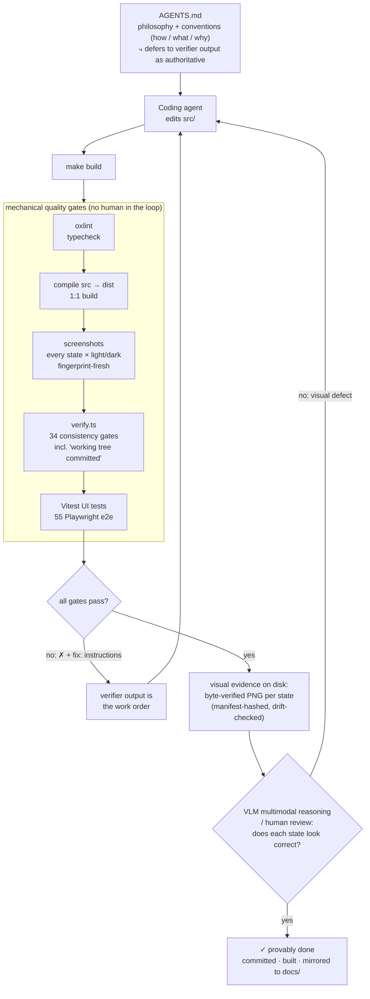

# ARCH — How this framework scales without a human reviewer

defuss-shadcn is built for an era where **coding agents do the work**. The
scaling bottleneck is no longer writing components — it is *trusting* them.
This repo solves trust with a closed loop: every artifact an agent produces
passes through mechanical quality gates designed by a human senior software engineer, and the gates talk back to the AI agent in the form of executable instructions. An agent can reach "done" only by satisfying every gate; the goal is unreachable any other way.

The method has four parts.

## 1. AGENTS.md — the philosophy layer

[`AGENTS.md`](AGENTS.md) tells a coding agent **how to work, what to
implement where, and why**: the native-web-platform-first rules (`<dialog>`,
popover, `:has()`, `@starting-style` — no libraries, no frameworks), the
component folder contract, the State API shape, the token boundary rule,
docs structure, and the authoring conventions. It is *teaching* — prose a
model reads before and while it works. Prose, however, is advisory: an agent
can misread it, skip it, or claim compliance. That is exactly what the next
layer is for.

## 2. The verifier — the authority layer

[`scripts/verify.ts`](scripts/verify.ts) is a custom, code-implemented audit
of everything prose cannot guarantee: **34 check groups** over the shipped
tree — skills exist, doc pages exist, tokens are tweakcn-compatible, snippets
match source, dist is a 1:1 build of src, every declared state has a
screenshot/skill/doc/e2e artifact, cross-page imports are complete, links
resolve, paths are portable, the working tree is committed, and more. Each
check reads the *actual* files and computes the truth; nothing is taken on
word.

Two properties make the verifier the loop's backbone:

- **It is the build gate.** `bun run build` compiles and then runs the
  verifier; `make build` runs the full pipeline ending in it plus the test
  suites. A build cannot "pass" while the verifier fails — there is no
  flag that skips it.
- **Its failure output is a repair instruction for the agent.** Every check
  prints, right after its failures, a `fix:` line naming the exact command,
  file, or template to apply — e.g. `fix: per component: 1) add fixture +
  test per tests/e2e/accordion.e2e.{ts,fixture.html}, 2) bun run e2e`. The
  verifier does not merely reject; it converts any agent into a
  self-correcting one. The agent's job reduces to: *edit → run → do what
  the output says → repeat.*
- **Because it is authoritative, its instructions *generate* missing
  artifacts.** The checks are coverage requirements, not style nits: add a
  component and the gates immediately demand its doc page, skill, State-API
  states, screenshots per state, and e2e pair — each with a `fix:` line
  naming the template to copy. The agent is therefore *triggered to write
  new tests* (and docs, and fixtures) it never planned to write: the task
  list comes from the verifier, not from the agent's memory of the
  conventions. This is how this repo's own test suite grew — the e2e rollout
  was nothing but a green-then-red-then-green walk down the
  `e2e smoke tests: tests/e2e/{name}.e2e.ts missing` list until all 55
  pairs existed and the ratchet could be promoted to a hard gate. Coverage
  is self-propagating: a future agent cannot silently skip a test, because
  "test missing" is itself a build failure with instructions attached.

## 3. AGENTS.md defers: verifier output is authoritative

AGENTS.md stresses that when prose and verifier disagree, **the verifier
wins** — its `fix:` lines are the work queue, and the legacy "warn-ratchet"
lists it still tolerates are migration debt it names explicitly, not license
to ignore it. The two files are one system: prose explains the *why*, the
verifier enforces the *what*, and prose points at the verifier as the final
word (`bun run verify` is the single "am I done?" question).

## 4. The surrounding gates — verification is not enough by itself

The verifier checks *consistency*. The loop wraps it with gates that check
*behavior, quality, and appearance*:

| Gate | Tool | Proves |
| --- | --- | --- |
| Lint | oxlint (`bun run lint`) | src/, tests/, scripts/ stay warning-clean |
| Type-check | strict `tsc --noEmit` | tests/ and scripts/ compile |
| Unit/integration | Vitest browser mode (`bun run test:run`) | real doc pages in a real Chromium iframe behave |
| E2E | 55 standalone Playwright scripts (`bun run e2e`) | every component's documented surface — interactions, keyboard, computed CSS |
| Screenshots | `bun run screenshots` | every declared **state × light/dark** PNG exists, is fresh vs. its input fingerprint, and the render manifest hash-detects drift |
| Git hygiene | verify check #23 | every verified byte is committed — what CI/other agents see is exactly what passed |

Screenshots close the last gap between machine checks and visual truth: they
are generated by driving each component's own `api.setState()`, hashed into
[`screenshots/manifest.json`](screenshots/manifest.json) alongside the
fingerprint of the inputs that produced them, and re-checked on every build
(stale or silently-drifted PNGs fail the build). What the loop guarantees
mechanically is therefore *proof of appearance*: for every state, a
byte-verified PNG of the shipped rendering exists and is on disk. The final
step — **a VLM reads those PNGs and reasons about whether each state looks
correct** — is the last gate, performed by the multimodal agent itself (or a
human) against the captured evidence. It is deliberately kept outside the
deterministic pipeline — model inference is non-reproducible and needs an API
key, so it cannot gate a build — but the loop's guarantee is what makes that
step trivial: the reviewer never has to wonder *which* render to look at or
whether it is current; the pipeline hands it every state, both schemes,
provably generated from the committed files. "Claims work" becomes "shown
working, to a viewer that can tell."

## The proof loop

(Mechanically-enforced gates end at "all gates pass"; the screenshot set is
the loop's guarantee of *evidence of appearance*. VLM reasoning over those
PNGs is the final review step — see the gate table above for why it lives
just outside the deterministic build.)

There is no exit into "done" that bypasses a gate. The agent is *trapped in
the loop until the work is actually good* — which is precisely the point:
human review does not scale to an army of agents, but a verifier that
audits every byte, speaks repair instructions, and is the only door out
does.
